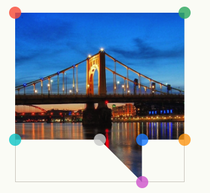

> 来自掘金小册[玩转css的艺术之美](https://juejin.cn/book/6850413616484040711)

查询各种浏览器中兼容性的网站[Caniuse](https://caniuse.com/)

## 回流和重绘

回流是指改变**几何属性**的渲染,可理解为将整个网页填白，对内容重新渲染一次.屏幕会从左上到右上,一排排的渲染.

重绘指改变**外观属性**,而不影响**几何属性**的渲染,重绘会温和一点,性能也是好一些.

读写 `offset`/`scroll`/`client` 等属性的时候,浏览器为了获取这些值,也需要进行回流操作.

> 如果想对回流/重绘浏览器原因进行了解,可以看[浏览器渲染之回流重绘](https://juejin.cn/post/7013131773756309517)
### 属性分类

* **几何属性**
  * 布局：`display`、`float`、`position`、`list`、`table`、`flex`、`columns`、`grid`等.
  * 尺寸：`margin`、`padding`、`border`、`width`、`height`等.
* **外观属性**
  * 界面：`appearance`、`outline`、`background`、`mask`、`box-shadow`、`box-reflect`、`filter`、`opacity`、`clip`等.
  * 文字：`text`、`font`、`word`等.

### 性能优化

#### 使用transform代替top  
使用`transform:translate3d(x,0,0)`代替top，只会引发图层重绘，还会间接启动GPU加速。

#### 将频繁回流重绘的节点设置为图层
设置新图层有两种方式，将节点设置为`<video>`或`<iframe>`，为节点声明[will-change](https://developer.mozilla.org/zh-CN/docs/Web/CSS/will-change)。

#### 使用`requestAnimationFrame`作为动画帧
浏览器刷新频率为60Hz，即每16.6ms更新一次，而`requestAnimationFrame()`正是以16.6ms的速度更新一次，所以可用`requestAnimationFrame()`代替`setInterval()`。

## 函数计算

### 属性函数 attr()
```html
<h1 class="Hello" data-name="word"></h1>
```
```scss
h1 {
	&::before {
		content: attr(class);
	}
	&::after {
		content: attr(data-name);
	}
}
```
用于返回节点属性,上述代码下页面显示内容 Helloword.

### calc()
有个小技巧,遇到因为有滚动条或无滚动条而导致网页路由在跳转时发生向左或向右的抖动,可以使用`calc()`去解决.
```css
padding-right: calc(100vw - 100%);
```
`100vw`是视窗宽度，`100%`是内容宽度，那100vw - 100%就是滚动条宽度了，声明`padding-right`用于保留滚动条出现的位置，这样滚动条出不出现都不会让网页抖动了。

### max()/min()/clamp()
`max(...val)`用于返回最大值，`min(...val)`用于返回最小值.

平时经常会遇到内容宽度100%自适应且最大值不超过1200px,正常代码如下:
```css
.elem {
	width: 100%;
	max-width: 1200px;
}
```
`min()`表示:
```css
.elem {
	width:  min(1200px, 100%);
}
```
`clamp(min, val, max)`用于返回区间范围值。`val`在`min~max`则返回val，`val`小于`min`则返回min，`val`大于`max`则返回`max`，妥妥的响应式函数。

## 图形函数
`clip-path`用于创建一个只有节点的部分区域可显示的剪切区域,可以看下[Clippy]这个网站,可以绘制原型椭圆和各种多边形,例如下图:



## CSS变量 var()

也叫**CSS自定义属性**,它由自定义属性`--var`与函数`var()`组成,一个例子就能看得懂用法:
```css
ul {
	--bg-color: red;
}
li {
	background-color: var(--bg-color);
}
```
子级的元素可以使用父级定义的自定义变量.
