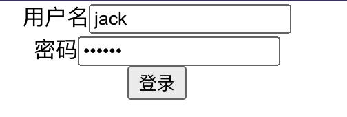

写个简单的登录页面:



## 代码
```tsx
import React, { FormEvent } from 'react'

const apiUrl = process.env.REACT_APP_API_URL

export const LoginScreen = () => {
  const login = (param: { username: string; password: string }) => {
    fetch(`${apiUrl}/login`, {
      // ...
    }).then(async (response) => {
      // ...
    })
  }

  const handleSubmit = (event: FormEvent<HTMLFormElement>) => {
    event.preventDefault()
    const username = (event.currentTarget.elements[0] as HTMLInputElement).value
    const password = (event.currentTarget.elements[1] as HTMLInputElement).value
    login({ username, password })
  }

  return (
    <form onSubmit={handleSubmit}>
      <div>
        <label htmlFor='username'>用户名</label>
        <input type='text' id={'username'} />
      </div>
      <div>
        <label htmlFor='password'>密码</label>
        <input type='password' id={'password'} />
      </div>
      <button type={'submit'}>登录</button>
    </form>
  )
}
```

## ts的难点问题

可以看到`onSubmit`函数的`event`类型是`FormEvent<HTMLFormElement>`,怎么知道是这个类型的呢?

1. 鼠标放到`onSubmit`上,可以查看ts签名:
```ts
React.DOMAttributes<HTMLFormElement>.onSubmit?: React.FormEventHandler<HTMLFormElement> | undefined
```
2. 按住`command`点击`onSubmit`函数,可以发现ts类型为:
```ts
onSubmit?: FormEventHandler<T> | undefined;
```

3. `FormEventHandler`类型为:
```ts
type FormEventHandler<T = Element> = EventHandler<FormEvent<T>>;
```

4. 泛型`T`就是 1 中的`HTMLFormElement`.再点击`FormEvent`就发现是继承了`SyntheticEvent`,而`SyntheticEvent`类型下就有`event`对应的方法.

```ts
interface FormEvent<T = Element> extends SyntheticEvent<T> {
}
```

5. 可以推断,`event`的类型就是`FormEvent<HTMLFormElement>`

## HTMLInputElement 哪里找到的呢?

因为是`input`标签返回的值,可以点击`input`标签找到对应的类型.
