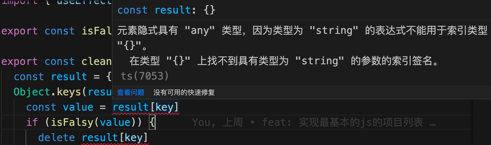

## 对于使用 svg 图片

react是支持可以直接显示svg的组件的:
```tsx
import { ReactComponent as SoftwareLogo } from 'assets/software-logo.svg'

<SoftwareLogo width={'18rem'} color={'rgb(38, 132, 255)'} />
```

## ts中的 object

在前面 `cleanObject` 清除空对象值的函数的下,有个ts报错:
```ts
export const cleanObject = (object: object) => {
  const result = { ...object }
  Object.keys(result).forEach((key) => {
    const value = result[key]
    if (isFalsy(value)) {
      delete result[key]
    }
  })
  return result
}
```


错误的原因是因为`object`类型范围是比较广的,这三种情况都不会报错:
```ts
let _object: object
_object = {}
_object = {name: 'xiaoming'}
_object = {...() => {}}
```
所以不排除他是个`{}`,解决办法如下:
```ts
const cleanObject = (object: { [key: string]: unknown }) => {})
```