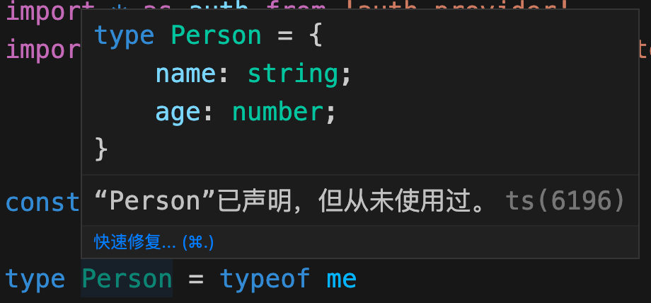

## 项目 demo

src目录下新建`project-list`目录,分别有`index.tsx`,负责搜索的`search-panel.tsx`,负责显示表单的`list.tsx`.

`index.tsx`核心内容:
```tsx
export const ProjectListScreen = () => {
  const [users, setUsers] = useState([]);
  const [param, setParam] = useState({
    name: "",
    personId: "",
  });
  const [list, setList] = useState([]);

  // 省略请求接口逻辑

  return (
    <div>
      <SearchPanel users={users} param={param} setParam={setParam} />
      <List users={users} list={list} />
    </div>
  );
};
```

这么写自然是会报错的,因为`<SearchPanel />`组件和`<List />`组件的prop类型并没有被定义,这2个组件的prop定义都不难.有点技巧的地方是对`setParam`函数的定义:

```tsx
interface SearchPanelProps {
  users: User[];
  param: {
    name: string;
    personId: string;
  };
  setParam: (param: SearchPanelProps["param"]) => void;
}
```
函数的参数的类型如果是在`interface`中定义的话,就可以用中括号的形式调用自己. 

## @ts-ignore 压制ts报错 

有些ts错误暂时不想解决,由因为报错影响后续开发,就可以在代码上方写上此注释.

## TS 基础知识

### tuple 元祖
tuple和array在js上都是数组,在ts中array是相同类型元素的结合.

而`tuple`元祖是可以由不同类型组成,但是长度固定的数组.

### unknown 类型
`any`可以表示任何类型的值,`unknown`也可以表示任何类型的值.

其实`unknown`是加强版本的`any`,不同的地方有2:
1. `unknown`类型的数据,不能调用其方法.
```ts
const value: unknown = 1
value.toString()  // 会报错
```
2. `unknown`不能当做值付给其他变量:
```ts
const value: unknown = 1
const init = value  // 会报错
```

### 泛型
假如有一个函数,我想我传进去的参数是string,那么返回的就是string,传number就返number.这就需要泛型了.
```ts
function returnFn<V>(value: V) {
  return value
}

// returnValue的类型就是 number 了`
const returnValue = returnFn(1)
```
箭头函数的泛型的位置不太一样:
```ts
const returnFn = <V>(value: V) => {
  return value
}
```

## TS的 Utility Type 操作符

### Partial
`partial`意思是`部分的,不完全的`.

假如有个`interface`:
```tsx
interface Person {
  name: string
  age: string
}
```
我们想让这两个参数变为可选参数,只需要加上`?`即可,`name?: string`.

但是有2个痛点:
1. 假如`interface`内容比较多,全部都加上`?`既麻烦又不美观.
2. 假如只有我这一个使用场景特殊,需要变成可选,改变原有的`interface`从而影响其他地方的代码,是非常不合理的.

故此,`partial`的应用场景就出现了:
```ts
const me: Partial<Person> = {}  // 没问题
```

### Omit

`Omit`的意思是**省去,遗漏**.

和`partial`的变为可选不同,`Omit`是直接删除掉某个参数:
```ts
const me: Omit<Person, 'name'> = { age: 8 }  // 传name或者空对象都会报错
```

::: tip 提示
`Utility Type` 操作符有很多,`Partial`和`Omit`是最常用的2个.
:::

### typeof

ts的`typeof`和js的`typeof`不一样,js的`typeof`都是**rentime运行时**的,而ts的`typeof`是在静态环境运行的,也就是说,编译成js后是不会有`typeof`内容的.

ts的`typeof`有什么用呢,我的理解是对其他类型进行解析,把js变成ts类型的意思,举2个例子:
```ts
const me = { name: 'senlin', age: 18 }
type Person = typeof me
```


`Person`的类型通过`typeof`正确推断出来了.

```ts
function me(name: string, age: number) {}

type Person = typeof me

// Person类型被推断出为:
type Person = (name: string, age: number) => void
```

::: tip typeof和其他操作符的配合
  除了用`typeof`去推断类型,还可以配合`Parameters`获取`typeof 函数`的参数类型,`ReturnType`获取函数的返回值类型.
:::

### Parameters 和 ReturnType

假如有个函数:
```ts
function me(name: string, age: number) {
  return { name, age, gender: '男'  }
}
```

`Parameters`的作用是把函数的参数类型用元祖`tuple`类型提取出来:
```ts
type Person = Parameters<typeof me>
// 鼠标移到Person上,显示类型为
type Person = [name: string, age: number]
```

`ReturnType`顾名思义,获取返回的类型:
```ts
type Person = ReturnType<typeof me>
// 等于
type Person = {
  name: string;
  age: number;
  gender: string;
}
```
