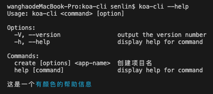

## 创建个全局命令

先`npm init`初始化项目,`package.json`中添加`bin`参数:
```json
{
  "name": "koa-cli",
  "bin": "./bin/cli",
  // ...
}
```
创建`/bin/cli`文件:
```js
#! /usr/bin/env node

console.log('koa-cli');
```

当前目录下执行`npm link`,把当前项目命令挂载到全局下,这样命令行执行`koa-cli`就可以看到输出了`koa-cli`了.

> `bin`字段也可以是对象,这样就可以拥有多个命令了.

## commander创建简单的查看版本号

`/bin/cli`:
```js
#! /usr/bin/env node

const program = require('commander')

program
  .version(`koa-cli ${require('../package.json').version}`)
  .usage('<command> [option]')


// 解析用户执行命令时传入的参数
program.parse(process.argv)
```
这样当我们命令行里输入`koa-cli --help`或者`koa-cli --version`的时候,都有会正确的输出.

## 创建个create命令
```js
program
  .command('create <app-name>')
  .description('创建项目名')
  .option('-f --force', '强制覆盖已存在的目录')
  .action((name, cmd) => {
    console.log(name, cmd);
  })
// ...
```
这样注册个命令后,当我们执行`koa-cli create test`时,命令行会输出`test {}`.

当加上`-f`参数后,会输出`test { force: true }`.

`action`函数中会把我们的命令和参数获取到.

## 给--help时,添加些其他信息

为了更美观一点,可以用`chalk`对输出上色.
```
npm install chalk@4.00
```
> 指定版本是因的5x版本`chalk`使用的是`default export`导出的.

`koa-cli --help`时,输出:



## 关于loading

安装`ora`即可.
```
npm install ora@5.4.1
```
```js
const spinner = ora('loading...').start();
await new Promise
spinner.succeed('ok')
```


