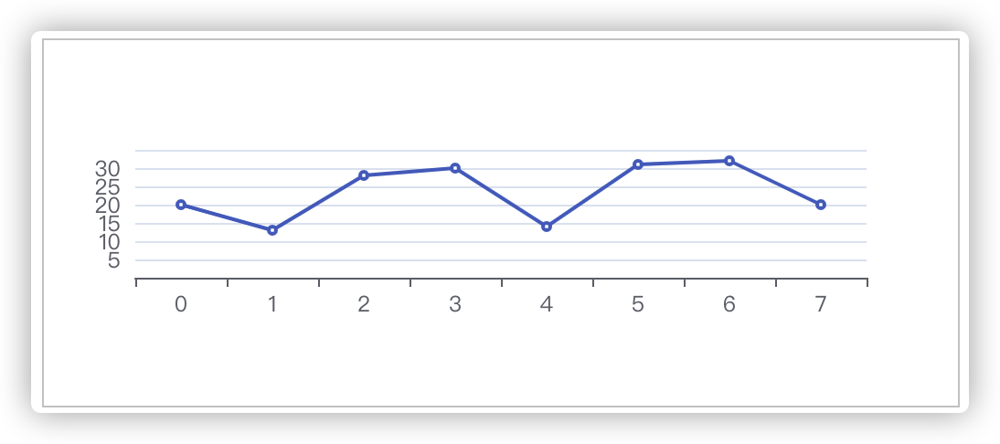
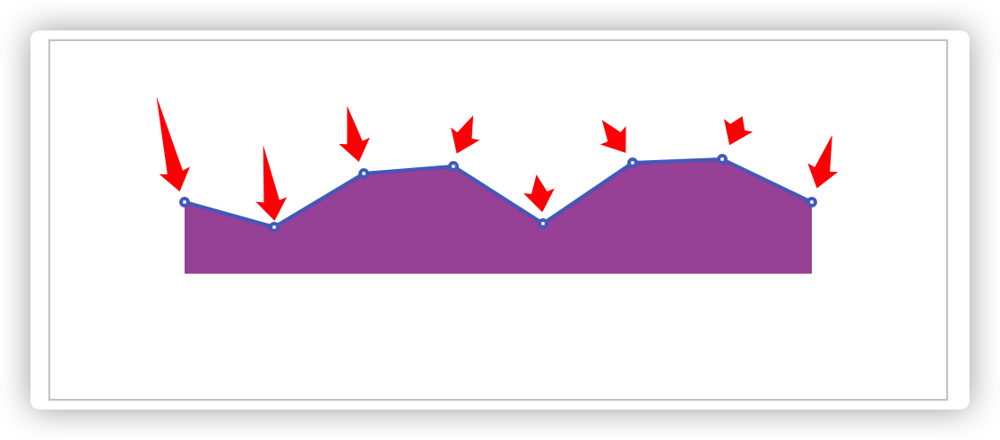
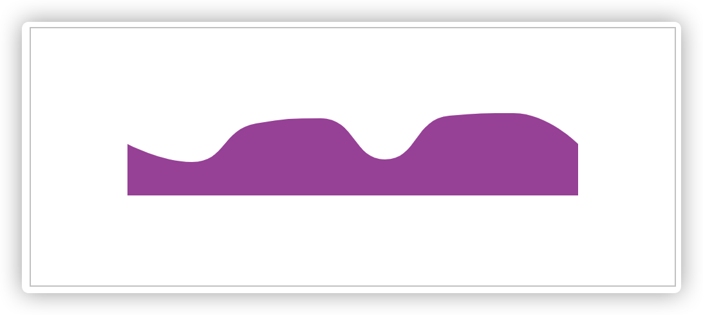
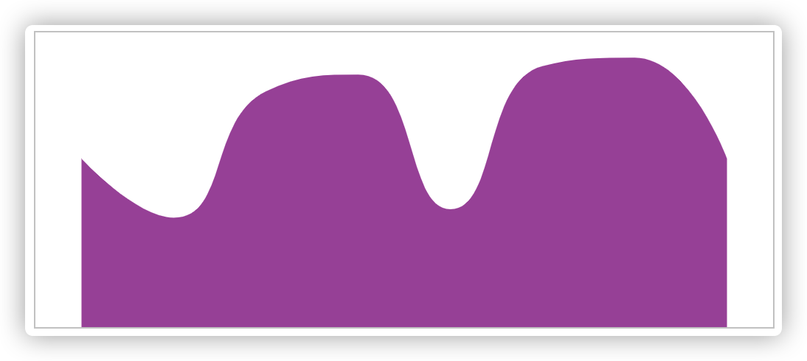

## 成品效果

<template>
  <dome1 ></dome1>
</template>

<script>
import dome1 from './components/line-chart'
export default {
  components: {
    dome1
  }
}
</script>

代码如下:

<<< ./docs/front/echarts/components/line-chart.vue{11-40}


## 初始的option配置

可以看下[echart官网中折线图的示例](https://echarts.apache.org/examples/zh/editor.html?c=line-simple&lang=js)

初始option内容如下:
```js
option = {
  xAxis: {
    type: "category",
  },
  yAxis: {},
  series: [{
    type: "line",
    data: [20, 13, 28, 30, 14, 31, 32, 20],
  }],
}
```


## 修正效果

和效果图相差甚远,有如下几点需要修正:
1. X轴的坐标和Y轴的坐标信息需要隐藏,设置`yAxis.show = false`和`xAxis.show = false`.
2. 折线图需要有填充色.设置`series.areaStyle.color = 'purple'`.(series 连续的,一系列)


3. 折线图的线和节点不需要展示,设置`series.lineStyle.width = 0`线条宽度为0,设置`series.itemStyle.opacity = 0`节点透明度0.
4. 折现拐角处转折需要更柔和一些,设置`series.smooth = true`.(smooth 光滑的,平坦的)


5. 需要把echart图表填充满整个div元素,需要设置`grid`(网格)属性:
```
grid: {
  top: 0,
  bottom: 0,
  left: 0,
  right: 0
}
```


6. 发现左右两侧还是有缝隙的,这是因为X轴默认有`boundaryGap`属性.(boundary边界,gap缺口).设置为false就可以了.`xAxis.boundaryGap = false`