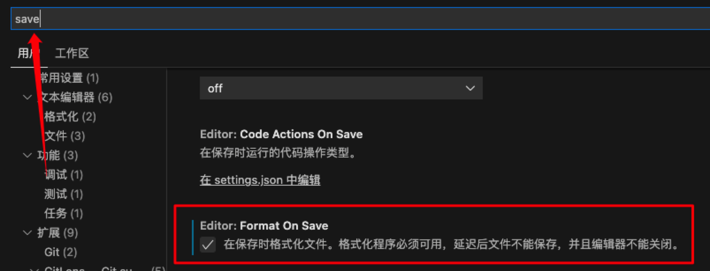

## 脚手架 create-react-app

```
npx create-react-app jira --template typescript
```

如果需要 TS,`npx create-react-app jira --template typescript`.

## prettier

[prettier 中文官网](https://www.prettier.cn/)

`prettier` 是什么呢:

- 代码格式化工具
- 可以集成在 vscode 中.
- 保存时,让代码直接符合`eslint`.

### 配置 prettier

1. 根据官网安装 `prettier`:

```
npm install --save-dev --save-exact prettier
```

2. 配置文件,根目录下新建`.prettierrc`文件,内容为 json 对象:

```json
{
  "printWidth": 80, //单行长度
  "tabWidth": 2, //缩进长度
  "semi": true, //句末使用分号
  "singleQuote": true, //使用单引号
  "jsxSingleQuote": true, // jsx中使用单引号
  "trailingComma": "none", //多行时不打印尾随逗号
  "bracketSpacing": true //在对象前后添加空格-eg: { foo: bar }
}
```

3. 对于一些不想被格式化的文件和目录可以用 `.prettierignore` 排除:

```
# Ignore artifacts:
build
coverage
dist

# Ignore all HTML files:
*.html
```

> 没有把`node_modules`排除是因为`prettier`默认就是排除`node_modules`文件夹的.

4. vscode 保存时自定格式化代码:

- 插件市场安装 **Prettier - Code formatter**.
- 点击设置,搜索设置关键字`save`,勾选`Format On Save`选项:
  
- 文件右键,点击`格式化文档`,选择`pretier-code formatter`即可.

### 手动格式化代码

- 格式化全部文档: `npx prettier --write .`
- 格式化指定文档: `npx prettier --write src/components/Button.js`
- 检查文档是否已格式化: `npx prettier --check .`

### git 提交时检测

前面虽然配置了 vscode 编辑器的自动保存,但是如果团队有人没有安装 vscode 插件,就会造成格式不统一.

所以,还需要在 git 提交时自动格式化,官网中有好几种方式,这里用[lint-staged](https://www.prettier.cn/docs/precommit.html)

```
npx mrm@2 lint-staged
```

可以发现`package.json`下多几个内容,其中`lint-staged`需要修改下,因为还需要加上 ts 文件:

```json
{
  "lint-staged": {
    "*.{js,css,md,ts,tsx}": "prettier --write"
  }
}
```

这时候关闭 vscode 插件,加个不符合规范的代码,再 git 提交一下,就发现代码已经被格式化了.
