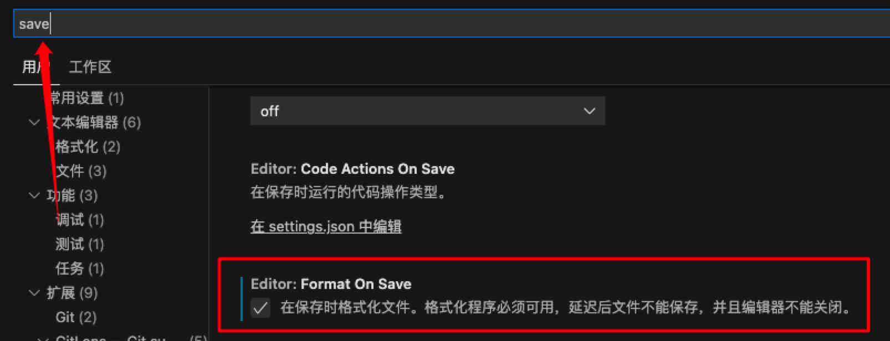
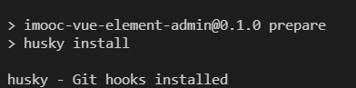

## 脚手架 create-react-app

```
npx create-react-app jira --template typescript
```

如果需要 TS,`npx create-react-app jira --template typescript`.

## prettier

[prettier 中文官网](https://www.prettier.cn/)

`prettier` 是什么呢:

- 代码格式化工具
- 可以集成在 vscode 中.
- 保存时,让代码直接符合`eslint`.

### 配置 prettier

1. 根据官网安装 `prettier`:

```
npm install --save-dev --save-exact prettier
```

2. 配置文件,根目录下新建`.prettierrc`文件,内容为 json 对象:

```json
{
  "printWidth": 80, //单行长度
  "tabWidth": 2, //缩进长度
  "semi": true, //句末使用分号
  "singleQuote": true, //使用单引号
  "jsxSingleQuote": true, // jsx中使用单引号
  "trailingComma": "none", //多行时不打印尾随逗号
  "bracketSpacing": true //在对象前后添加空格-eg: { foo: bar }
}
```

3. 对于一些不想被格式化的文件和目录可以用 `.prettierignore` 排除:

```
# Ignore artifacts:
build
coverage
dist

# Ignore all HTML files:
*.html
```

> 没有把`node_modules`排除是因为`prettier`默认就是排除`node_modules`文件夹的.

4. vscode 保存时自定格式化代码:

- 插件市场安装 **Prettier - Code formatter**.
- 点击设置,搜索设置关键字`save`,勾选`Format On Save`选项:
  
- 文件右键,点击`格式化文档`,选择`pretier-code formatter`即可.

### 手动格式化代码

- 格式化全部文档: `npx prettier --write .`
- 格式化指定文档: `npx prettier --write src/components/Button.js`
- 检查文档是否已格式化: `npx prettier --check .`

### git 提交时检测

前面虽然配置了 vscode 编辑器的自动保存,但是如果团队有人没有安装 vscode 插件,就会造成格式不统一.

所以,还需要在 git 提交时自动格式化,官网中有好几种方式,这里用[lint-staged](https://www.prettier.cn/docs/precommit.html)

```
npx mrm@2 lint-staged
```

可以发现`package.json`下多几个内容,其中`lint-staged`需要修改下,因为还需要加上 ts 文件:

```json
{
  "lint-staged": {
    "*.{js,css,md,ts,tsx}": "prettier --write"
  }
}
```

这时候关闭 vscode 插件,加个不符合规范的代码,再 git 提交一下,就发现代码已经被格式化了.

## git 提交规范工具 commitizen

一句话概括`commitizen`: 当使用`commitizen`进行代码提交时,`commitizen`会要求提交必填字段,`commitizen`的 github 仓库名叫做`cz-cli`,是用`git cz`指令代替`git commit`.

### 配置 commitizen

1. 全局安装 `commitizen`: `npm install -g commitizen@4.2.4`
2. 安装和配置 `cz-customizable` 插件: `npm i cz-customizable@6.3.0 --save-dev`
3. `package.json`配置参数,指定配置项文件地址:

```json
...
"config": {
  "commitizen": {
    "path": "node_modules/cz-customizable"
  }
}
```

4. 项目根目录下创建 `.cz-config.js` 自定义提示文件:

```js
module.exports = {
  // 可选类型
  types: [
    { value: "feat", name: "feat:     新功能" },
    { value: "fix", name: "fix:      修复" },
    { value: "docs", name: "docs:     文档变更" },
    { value: "style", name: "style:    代码格式(不影响代码运行的变动)" },
    {
      value: "refactor",
      name: "refactor: 重构(既不是增加feature，也不是修复bug)",
    },
    { value: "perf", name: "perf:     性能优化" },
    { value: "test", name: "test:     增加测试" },
    { value: "chore", name: "chore:    构建过程或辅助工具的变动" },
    { value: "revert", name: "revert:   回退" },
    { value: "build", name: "build:    打包" },
  ],
  // 消息步骤
  messages: {
    type: "请选择提交类型:",
    customScope: "请输入修改范围(可选):",
    subject: "请简要描述提交(必填):",
    body: "请输入详细描述(可选):",
    footer: "请输入要关闭的issue(可选):",
    confirmCommit: "确认使用以上信息提交？(y/n/e/h)",
  },
  // 跳过问题
  skipQuestions: ["body", "footer"],
  // subject文字长度默认是72
  subjectLimit: 72,
};
```

**后续就使用 `git cz` 代替 `git commit`了,并且会根据配置文件的定义提供不同的输入模板.**

## 禁止不规范的 `git commit` 提交

如果团队有人不用`git cz`而是用`git commit`提交,那么规范就会被打破了.解决方法就是禁止不符合提交规范信息的`git commit`命令.

这里就需要用到`git hooks`的概念了,

## git hooks

在进行 git 操作的时候,一些钩子会被触发,具体的 hooks 钩子函数比较多,可以看[官网查看](https://git-scm.com/docs/githooks).

虽然整体的 hooks 比较多,但是比较常用的就 2 个:

| Git Hook   | 调用时机 | 说明 |
| -- | :----: | :--: |
| pre-commit |  `git commit`执行前,它不接受任何参数，并且在获取提交日志消息并进行提交之前被调用。脚本git commit以非零状态退出会导致命令在创建提交之前中止。  | 可以用`git commit --no-verify`绕过 |
| commit-msg | git commit执行前,可用于将消息规范化为某种项目标准格式。还可用于在检查消息文件后拒绝提交。|可以用`git commit --no-verify`绕过|

::: tip git提交时自动 prettier 格式化代码时已经用到了 pre-commit 的hooks了.
  可以在根目录`.husky`文件下看到`pre-commit`配置文件以及内容.
:::

很明显,校验`commit`信息规范,需要配置`commit-msg`钩子.

## 使用 husky + commitlint 检查提交描述是否符合规范

1. 先安装依赖:
```
npm install --save-dev @commitlint/config-conventional@12.1.4 @commitlint/cli@12.1.4
```
2. 创建 commitlint.config.js 文件
```
echo "module.exports = {extends: ['@commitlint/config-conventional']}" > commitlint.config.js
```
3. 除了默认的继承规则,还要自定义规则:
```js
module.exports = {
  // 继承的规则
  extends: ['@commitlint/config-conventional'],
  // 定义规则类型
  rules: {
    // type 类型定义，表示 git 提交的 type 必须在以下类型范围内
    'type-enum': [
      2,
      'always',
      [
        'feat', // 新功能 feature
        'fix', // 修复 bug
        'docs', // 文档注释
        'style', // 代码格式(不影响代码运行的变动)
        'refactor', // 重构(既不增加新功能，也不是修复bug)
        'perf', // 性能优化
        'test', // 增加测试
        'chore', // 构建过程或辅助工具的变动
        'revert', // 回退
        'build' // 打包
      ]
    ],
    // subject 大小写不做校验
    'subject-case': [0]
  }
}
```

### 安装 husky
1. 安装依赖:
```
npm install husky@7.0.1 --save-dev
```
2. 启动 `hooks` ， 生成 `.husky` 文件夹:
```
npx husky install
```
3. 在 `package.json` 中生成 `prepare` 指令 **（需要 npm > 7.0 版本）**
```
npm set-script prepare "husky install"
```
4. 执行 `prepare` 命令,`npm run prepare`.



::: tip 下面才是没有配置的内容
  因为前面 lint-staged 的存在,上面的几个步骤已经ok了
:::
5. 添加 `commitlint` 的 hook 到 husky中，并指令在 `commit-msg` 的 hooks 下执行 `npx --no-install commitlint --edit "$1"` 指令:
```
npx husky add .husky/commit-msg 'npx --no-install commitlint --edit "$1"'
```
6. 此时`.husky`目录下就有了`commit-msg`的配置文件了.自此,不符合规范的commit提交将会被阻止.


