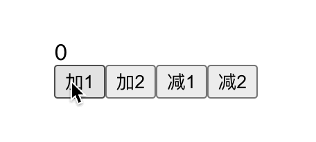
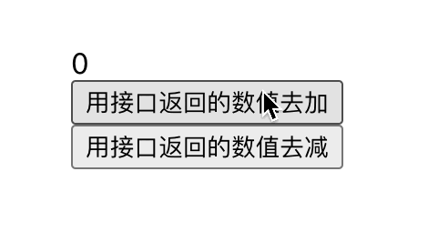

## 认识redux

作为最老牌的react状态管理工具,`redux`既简单又复杂.

简单是因为`redux`的核心就是创建`store`,和操作`store`的`reducer`配置.

复杂是因为,如果想用好`rudex`,就要利用好`redux`的周边:
* redux-thunk: 中间件,处理异步的
* redux-sage: 中间件,处理异步的,和`redux-thunk`比约束更强一点.
* redux-devtools: Chrome浏览器插件,方便查看store中数据.
* react-redux: 用于连接`react`和`redux`的工具.
* ImmutableJS: 不管是组件的`state`还是`redux`管理的`state`,数据的不可变性是非常重要的,当我们每次想要修改`state`时,就只能用拷贝的方式去生成新的`state`.如果数据较多,或者操作比较频繁,性能开销就会很浪费.为了解决这种问题,facebook开源了`ImmutableJS`.

除此之外,当业务复杂后,redux的`store`和`reducer`对象会变的庞杂,怎么合理的拆分也是难点之一.

### Redux的三大原则
* 单一数据源
  * 虽然`Redux`没有强制只有一个`Store`,但是单一的数据源会更好的维护、追踪、修改.
* State是只读的
  * 这样可以确保所有修改都是集中化处理,并且按照严格的顺序来执行,不会出现多个地方频繁修改导致的数据混乱.
  * 并且`store`提供了`subscribe`方法,如果能随意修改`state`下的属性值,监听就会变的很麻烦.
* 使用纯函数来执行修改
  * 简单概括纯函数就是,给确定的参数,就能获取确定的内容,不会受到外部变量的影响.没有副作用.
  * `reducer`就是纯函数.

## 简单使用

做个简单的计数器,先创建store仓库:
```js
// store/index.js
import { createStore } from 'redux'
import reducer from './reducer';

const store = createStore(reducer);

export default store;
```

```js
// store/reducer.js
const defaultState = {
	number: 0
}

export default (state = defaultState, action) => {
  const { type, value } = action
	if (type === 'add') {
		const newState = JSON.parse(JSON.stringify(state));
    newState.number = newState.number + value
		return newState;
	}
	if (type === 'minus') {
		const newState = JSON.parse(JSON.stringify(state));
    newState.number = newState.number - value
		return newState;
	}
	return state;
}
```

在组件中使用:
```js
import { Component } from 'react';
import store from '../store';

class Home extends Component {
  constructor(props) {
		super(props);
		this.state = store.getState()
    this.handleStoreChange = this.handleStoreChange.bind(this);
  }
	componentWillMount() {
    store.subscribe(this.handleStoreChange);
  }
  handleStoreChange() {
		this.setState(store.getState());
	}
  render() {
    return (
      <div>
        <div>{this.state.number}</div>
        <button onClick={() => add(1)}>加1</button>
        <button onClick={() => add(2)}>加2</button>
        <button onClick={() => minus(1)}>减1</button>
        <button onClick={() => minus(2)}>减2</button>
      </div>
    )
  }
}
function add(value) {
  store.dispatch({
    type: "add",
    value
  })
}
function minus(value) {
  store.dispatch({
    type: "minus",
    value
  })
}
export default Home;
```

效果如下:



可以看到用到的`api`如下:
* 创建`store`的`createStore`,参数为自定义的`reducer`.
* 实例上的`getState`方法可以获取当前`store`的`state`.
* 实例上的`dispatch`方法可以根据自定义的`action`对象触发对应的`reducer`函数的内部逻辑.
* 实例上的`subscribe`方法可以监听`state`的改变,如果变动了触发回调函数.

::: tip hook中怎么用呢?
没法用,如果想要显示数据并修改,就要用useState.

当然,也可以用`react-redux`,把`store`放进`props`去管理.
:::

## 使用react-redux

`react-redux`最核心的用法是,提供了`Provider`组件,挂载`store`作为props传递下去,使用`store`数据的组件,用`connect`函数包裹组件,注入props.

`connect`需要传入2个参数,一个是作为`store`数据的映射,一个是作为`dispatch`方法的映射.

```js
// App.js
import Home from './view/home'
import store from './store'
import { Provider } from 'react-redux'

function App() {
  return (
    <Provider store={store}>
      <Home />
    </Provider>
  )
}

export default App;
```

```js
// Home.js
import { connect } from 'react-redux'

function Home(props) {
  const { number, add, minus } = props
  return (
    <div>
      <div>{number}</div>
      <button onClick={() => add(1)}>加1</button>
      <button onClick={() => add(2)}>加2</button>
      <button onClick={() => minus(1)}>减1</button>
      <button onClick={() => minus(2)}>减2</button>
    </div>
  );
}

function mapStateToProps(state) {
  return {
    number: state.number
  }
}

function mapDispatchToProps(dispatch) {
  return {
    add(value) {
      dispatch({
        type: "add",
        value
      })
    },
    minus(value) {
      dispatch({
        type: "minus",
        value
      })
    }
  }
}

export default connect(mapStateToProps, mapDispatchToProps)(Home)
```

## redux的中间件applyMiddleware

`redux`的中间件,是在触发`dispatch`传递`action`到`reducer`之间,做一些自己的事情.

`redux-thunk`/`redux-saga`/`redux-devtools`都是中间件.

通过`redux`提供的`applyMiddleware`去注册中间件.(下面会有示例)

## redux-thunk

通过ajax获取到的数据本身也是状态的一部分,相应的逻辑应该也是由`redux`去管理.

`redux-thunk`的功能是,我们的`dispatch`的`action`不仅仅是一个对应,也可以是一个函数.

这里会把`action`用一个文件统一管理.

```js
// store/index.js
import { createStore, applyMiddleware } from 'redux'
import thunk from 'redux-thunk';
import reducer from './reducer';

const enhancer = applyMiddleware(thunk)

const store = createStore(reducer, enhancer);

export default store;
```

```js
// store/action.js
import { add, minus } from '../api'

export const addAction = (value) => ({
  type: "add",
  value
})

export const minusAction = (value) => ({
  type: "minus",
  value
})

export const getAddNumberAction = () => {
  return (dispatch) => {
    add().then(res => {
      dispatch(addAction(res))
    })
  }
}

export const getMinusNumberAction = () => {
  return (dispatch) => {
    minus().then(res => {
      dispatch(minusAction(res))
    })
  }
}
```
`add`和`minus`会返回promise,250毫秒异步获取一个`number`.

`Home`组件映射方法,`dispatch`我们定义好的异步`action`即可,异步会再次调用对象的`action`完成数据更新.
```js
import { getAddNumberAction, getMinusNumberAction } from '../store/action'
// ...其余代码
function mapDispatchToProps(dispatch) {
  return {
    add() {
      dispatch(getAddNumberAction())
    },
    minus() {
      dispatch(getMinusNumberAction())
    }
  }
}
// ...其余代码
```

效果如下:



## redux-devtools

浏览器插件[redux-devtools](https://chrome.google.com/webstore/detail/redux-devtools/lmhkpmbekcpmknklioeibfkpmmfibljd/related?utm_source=chrome-ntp-icon)可以方便的让我们对`store`状态进行跟踪和调试.

先在浏览器上安装插件,再在`redux`中集成`devtools`的中间件:
```js
// store/index.js
import { createStore, applyMiddleware, compose } from 'redux'
import thunk from 'redux-thunk';
import reducer from './reducer';

const composeEnhancers = window.__REDUX_DEVTOOLS_EXTENSION_COMPOSE__({ trace: true }) || compose
const enhancer = applyMiddleware(thunk)

const store = createStore(reducer, composeEnhancers(enhancer))

export default store;
```
打开浏览器控制台,就会有显示了Redux的插件了.

## react-saga

`react-saga`和`react-thunk`一样同为异步数据管理中间件,最大的不同是,`react-saga`需要维护个`sagas.js`文件,里面定义的函数通过`takeEvery`同样订阅到`action`的`type`,再利用`put`方法派发`action`到`reducer`.

### 核心api
* `sagaMiddleware.run`方法,参数是是`sagas`函数,配置后,`sagas`函数内就能收到推送的`action`了.
* `takeEvery`,`takeLatest`: 都可以接收`dispath`推送的`action.type`.
  * `takeLatest`是可以取消上次的动作.什么意思呢?假如我有一个ajax请求,再没有返回内容的时候再次触发,会取消前面的请求.(粗浅理解,不见得对)
* `put`: 发送`action`用的.
* `all`: 算是个语法糖,是个数组,可以把多个`put`,多个`takeEvery`,多个`takeLatest`用数组装起来,减少了代码量.

```js
// store/index.js
import { createStore, applyMiddleware, compose } from 'redux'
import createSageMiddleware from 'redux-saga'
import reducer from './reducer';
import saga from './sagas'

const sagaMiddleware = createSageMiddleware()

const composeEnhancers = window.__REDUX_DEVTOOLS_EXTENSION_COMPOSE__({ trace: true }) || compose

const enhancer = applyMiddleware(sagaMiddleware)

const store = createStore(reducer, composeEnhancers(enhancer))

sagaMiddleware.run(saga)

export default store;
```

```js
// store/sagas.js
import { takeEvery, all, put } from 'redux-saga/effects'
import { add, minus } from '../api'

function* getAddNumber() {
  const value = yield add()
  yield put({
    type: "add",
    value
  })
}

function* getMinusNumber() {
  const value = yield minus()
  yield put({
    type: "minus",
    value
  })
}

function* mySaga() {
  yield all([
    takeEvery('getAddNumber', getAddNumber),
    takeEvery('getMinusNumber', getMinusNumber)
  ])
}

export default mySaga
```
```js
// home.js
// 映射的 dispatch
function mapDispatchToProps(dispatch) {
  return {
    add() {
      dispatch({
        type: "getAddNumber"
      })
    },
    minus() {
      dispatch({
        type: "getMinusNumber"
      })
    }
  }
}
```

## reducer文件拆分 combineReducers

如果业务上不仅要有home模块,还有count等多个模块,那么`reducer`文件就会越来越大难以维护.

分成多个模块文件夹后,用`combineReducers`进行处理即可:
```js
// store/index.js
import { combineReducers } from 'redux'
import { reducer as counterReducer } from './count'
import { reducer as homeReducer } from './home'

export const reducer = combineReducers({
  counterInfo: counterReducer,
  homeInfo: homeReducer,
})
```

### immutable下的reducer拆分

```js
import { combineReducers } from 'redux-immutable'
// ...
```


