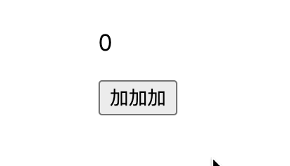
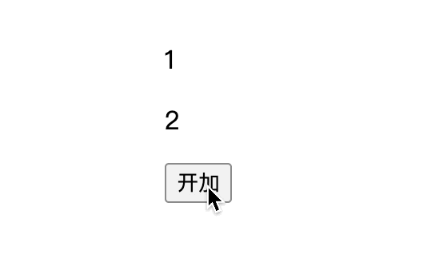

## ref

`ref()`可以创建一个响应式数据,也可以用于获取`DOM`元素.

### 响应式效果:

代码如下:

<<< ./docs/front/vue/components/ref-demo1.vue

### dome获取

<<< ./docs/front/vue/components/ref-demo2.vue

> 写了个丑陋的`any`,后续更懂一点TS再改

## reactive

和ref功能相似,也是创建个响应式数据,但是一般ref会用于创建number,string类型的数据,而reactive是创建对象数据.

响应式效果:

<<< ./docs/front/vue/components/reactive-demo1.vue

